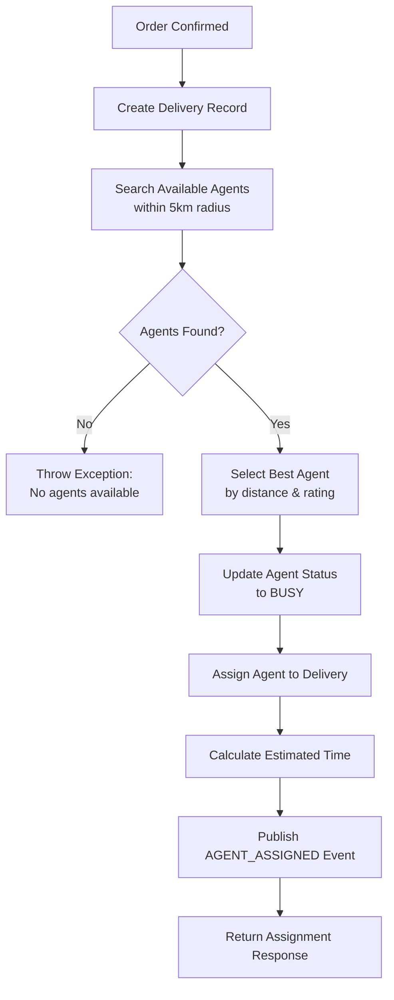

# Delivery Agent Assignment Algorithm

## Overview

The delivery agent assignment algorithm automatically selects the best available delivery agent for each order based on proximity and rating. The algorithm ensures fast assignment (within 2 minutes) and optimal delivery experience.

## Requirements

- **5.1**: Assignment within 2 minutes of order confirmation
- **5.2**: Proximity-based selection within 5km radius
- **5.4**: Send assignment notification to agent and customer

## Algorithm Flow



## Selection Criteria

### 1. Availability Filter
Only agents with status `AVAILABLE` are considered.

### 2. Proximity Filter
Agents must be within **5km radius** of the restaurant location.

Uses Haversine formula for distance calculation:
```sql
SELECT * FROM delivery_agents 
WHERE status = 'AVAILABLE' 
AND current_latitude IS NOT NULL 
AND current_longitude IS NOT NULL 
AND (6371 * acos(cos(radians(:latitude)) * cos(radians(current_latitude)) * 
    cos(radians(current_longitude) - radians(:longitude)) + 
    sin(radians(:latitude)) * sin(radians(current_latitude)))) <= :radiusKm 
ORDER BY rating DESC
```

### 3. Ranking
Agents are sorted by:
1. **Distance** (closest first)
2. **Rating** (highest first)

The query returns agents already sorted, so the first agent is selected.

## Implementation

### API Endpoint

```http
POST /api/delivery/assign
Content-Type: application/json

{
  "orderId": 123,
  "restaurantLatitude": 40.7580,
  "restaurantLongitude": -73.9855,
  "deliveryLatitude": 40.7489,
  "deliveryLongitude": -73.9680
}
```

### Response

```json
{
  "orderId": 123,
  "deliveryId": 456,
  "agentId": 789,
  "agentName": "Motorcycle - ABC-1234",
  "estimatedMinutes": 25,
  "assignedAt": "2024-01-15T10:30:00"
}
```

### Service Method

```java
@Transactional
public AssignmentResponse assignAgent(AssignAgentRequest request) {
    // 1. Create or get delivery record
    Delivery delivery = getOrCreateDelivery(request);
    
    // 2. Find available agents within radius
    List<DeliveryAgent> availableAgents = agentRepository
        .findAvailableAgentsWithinRadius(
            request.getRestaurantLatitude(),
            request.getRestaurantLongitude(),
            searchRadiusKm
        );
    
    // 3. Check if agents found
    if (availableAgents.isEmpty()) {
        throw new DeliveryException("No available agents found");
    }
    
    // 4. Select best agent (first in sorted list)
    DeliveryAgent selectedAgent = availableAgents.get(0);
    
    // 5. Update agent status to BUSY
    selectedAgent.setStatus(AgentStatus.BUSY);
    agentRepository.save(selectedAgent);
    
    // 6. Assign agent to delivery
    delivery.setDeliveryAgentId(selectedAgent.getId());
    delivery.setStatus(DeliveryStatus.ASSIGNED);
    delivery.setAssignedAt(LocalDateTime.now());
    
    // 7. Calculate estimated delivery time
    double distance = calculateDistance(...);
    delivery.setEstimatedMinutes(estimateTime(distance));
    deliveryRepository.save(delivery);
    
    // 8. Publish AGENT_ASSIGNED event
    eventPublisher.publishAgentAssigned(delivery, selectedAgent);
    
    return buildResponse(delivery, selectedAgent);
}
```

## Distance Calculation

### Haversine Formula

Calculates the great-circle distance between two points on Earth:

```java
public double calculateDistance(Double lat1, Double lon1, Double lat2, Double lon2) {
    final int EARTH_RADIUS_KM = 6371;
    
    double dLat = Math.toRadians(lat2 - lat1);
    double dLon = Math.toRadians(lon2 - lon1);
    
    double a = Math.sin(dLat / 2) * Math.sin(dLat / 2) +
               Math.cos(Math.toRadians(lat1)) * Math.cos(Math.toRadians(lat2)) *
               Math.sin(dLon / 2) * Math.sin(dLon / 2);
    
    double c = 2 * Math.atan2(Math.sqrt(a), Math.sqrt(1 - a));
    
    return EARTH_RADIUS_KM * c;
}
```

### Delivery Time Estimation

Assumes average speed of 30 km/h:

```java
public int estimateDeliveryTime(double distanceKm) {
    final double AVERAGE_SPEED_KMH = 30.0;
    double hours = distanceKm / AVERAGE_SPEED_KMH;
    return (int) Math.ceil(hours * 60); // Convert to minutes
}
```

## Event Publishing

### AGENT_ASSIGNED Event

Published to Kafka topic `delivery-events`:

```json
{
  "eventId": "uuid",
  "eventType": "AGENT_ASSIGNED",
  "deliveryId": 456,
  "orderId": 123,
  "agentId": 789,
  "timestamp": "2024-01-15T10:30:00",
  "payload": {
    "agentId": 789,
    "agentUserId": 101,
    "vehicleType": "Motorcycle",
    "vehicleNumber": "ABC-1234",
    "estimatedMinutes": 25,
    "restaurantLatitude": 40.7580,
    "restaurantLongitude": -73.9855,
    "deliveryLatitude": 40.7489,
    "deliveryLongitude": -73.9680
  }
}
```

This event triggers:
- Notification to customer (via Notification Service)
- Notification to restaurant (via Notification Service)
- Notification to agent (via Notification Service)
- Order status update (via Order Service)

## Configuration

### Application Properties

```yaml
delivery:
  assignment:
    search-radius-km: 5          # Search radius in kilometers
    assignment-timeout-minutes: 2 # Max time for assignment
```

### Customization

Adjust search radius based on:
- City density (smaller radius in dense cities)
- Agent availability (larger radius if few agents)
- Time of day (larger radius during off-peak hours)

## Error Handling

### No Agents Available

```json
{
  "errorCode": "DELIVERY_ERROR",
  "message": "No available delivery agents found within 5km radius",
  "timestamp": "2024-01-15T10:30:00",
  "path": "/api/delivery/assign"
}
```

**Possible Causes:**
- All agents are BUSY or OFFLINE
- No agents within 5km radius
- No agents have updated their location

**Solutions:**
1. Increase search radius temporarily
2. Wait and retry after timeout
3. Notify customer of delay
4. Offer alternative delivery options

### Agent Becomes Unavailable

If selected agent goes OFFLINE before accepting:
- Assignment fails
- Retry with next available agent
- Maximum 3 retry attempts

## Performance Optimization

### Database Indexes

```sql
CREATE INDEX idx_agents_status ON delivery_agents(status);
CREATE INDEX idx_agents_location ON delivery_agents(current_latitude, current_longitude);
CREATE INDEX idx_agents_rating ON delivery_agents(rating DESC);
```

### Query Optimization

- Spatial index for location queries
- Composite index on (status, rating)
- Limit results to top 10 agents

### Caching

Cache agent locations in Redis:
- Key: `agent:location:{agentId}`
- TTL: 60 minutes
- Update on every location update

## Testing

### Unit Tests

```java
@Test
void shouldAssignClosestAvailableAgent() {
    // Given: Multiple available agents at different distances
    // When: Assignment is requested
    // Then: Closest agent is selected
}

@Test
void shouldThrowExceptionWhenNoAgentsAvailable() {
    // Given: No available agents
    // When: Assignment is requested
    // Then: DeliveryException is thrown
}

@Test
void shouldUpdateAgentStatusToBusy() {
    // Given: Available agent
    // When: Agent is assigned
    // Then: Agent status is BUSY
}

@Test
void shouldPublishAgentAssignedEvent() {
    // Given: Successful assignment
    // When: Agent is assigned
    // Then: AGENT_ASSIGNED event is published
}
```

### Integration Tests

```bash
# Setup: Create available agents
curl -X POST http://localhost:8085/api/delivery/agents \
  -d '{"userId": 1, "vehicleType": "Motorcycle", "vehicleNumber": "ABC-1"}'

curl -X PUT http://localhost:8085/api/delivery/agents/1/status \
  -d '{"status": "AVAILABLE"}'

curl -X PUT http://localhost:8085/api/delivery/agents/1/location \
  -d '{"latitude": 40.7580, "longitude": -73.9855}'

# Test: Assign agent
curl -X POST http://localhost:8085/api/delivery/assign \
  -d '{
    "orderId": 123,
    "restaurantLatitude": 40.7580,
    "restaurantLongitude": -73.9855,
    "deliveryLatitude": 40.7489,
    "deliveryLongitude": -73.9680
  }'

# Verify: Agent status is BUSY
curl http://localhost:8085/api/delivery/agents/1

# Verify: Delivery is assigned
curl http://localhost:8085/api/delivery/track/123
```

### Load Testing

Simulate high assignment volume:

```bash
# 100 concurrent assignments
ab -n 100 -c 10 -T 'application/json' \
  -p assign.json \
  http://localhost:8085/api/delivery/assign
```

**Performance Targets:**
- Assignment time: < 500ms (p95)
- Throughput: > 100 assignments/second
- Success rate: > 99%

## Monitoring

### Key Metrics

1. **Assignment Success Rate**: % of successful assignments
2. **Assignment Time**: Time from request to assignment
3. **Agent Utilization**: % of time agents are BUSY
4. **Search Radius Hits**: % of assignments within 5km
5. **Average Distance**: Average distance between agent and restaurant

### Alerts

- Assignment failure rate > 5%
- Assignment time > 2 minutes
- No available agents for > 5 minutes
- Agent utilization < 20% (too many agents)
- Agent utilization > 90% (need more agents)

### Logging

```java
log.info("Assigning agent for order: {}", orderId);
log.info("Found {} available agents within {}km", count, radius);
log.info("Selected agent {} (distance: {}km, rating: {})", 
    agentId, distance, rating);
log.warn("No available agents found within {}km for order: {}", 
    radius, orderId);
```

## Manual Assignment

For special cases, admins can manually assign a specific agent:

```http
POST /api/delivery/assign/{orderId}/agent/{agentId}
```

Use cases:
- VIP customer requests specific agent
- Agent specialization (e.g., fragile items)
- Retry after automatic assignment failure
- Testing and debugging

## Future Enhancements

### 1. Machine Learning
- Predict agent availability
- Optimize assignment based on historical data
- Learn agent preferences and strengths

### 2. Dynamic Radius
- Adjust radius based on agent density
- Expand radius during peak hours
- Contract radius in dense areas

### 3. Multi-Factor Scoring
```java
score = (distance_weight * distance_score) + 
        (rating_weight * rating_score) + 
        (experience_weight * experience_score)
```

### 4. Batch Assignment
- Assign multiple orders to one agent
- Optimize route for multiple pickups
- Reduce overall delivery time

### 5. Predictive Assignment
- Pre-assign agents to hot zones
- Anticipate order volume
- Position agents strategically

## Requirements Satisfied

- ✅ **5.1**: Assignment within 2 minutes
- ✅ **5.2**: Proximity-based selection (5km radius)
- ✅ **5.4**: Assignment notification via events
- ✅ Automatic agent selection
- ✅ Distance and rating-based ranking
- ✅ Event-driven architecture
- ✅ Error handling for no agents
- ✅ Manual assignment option

