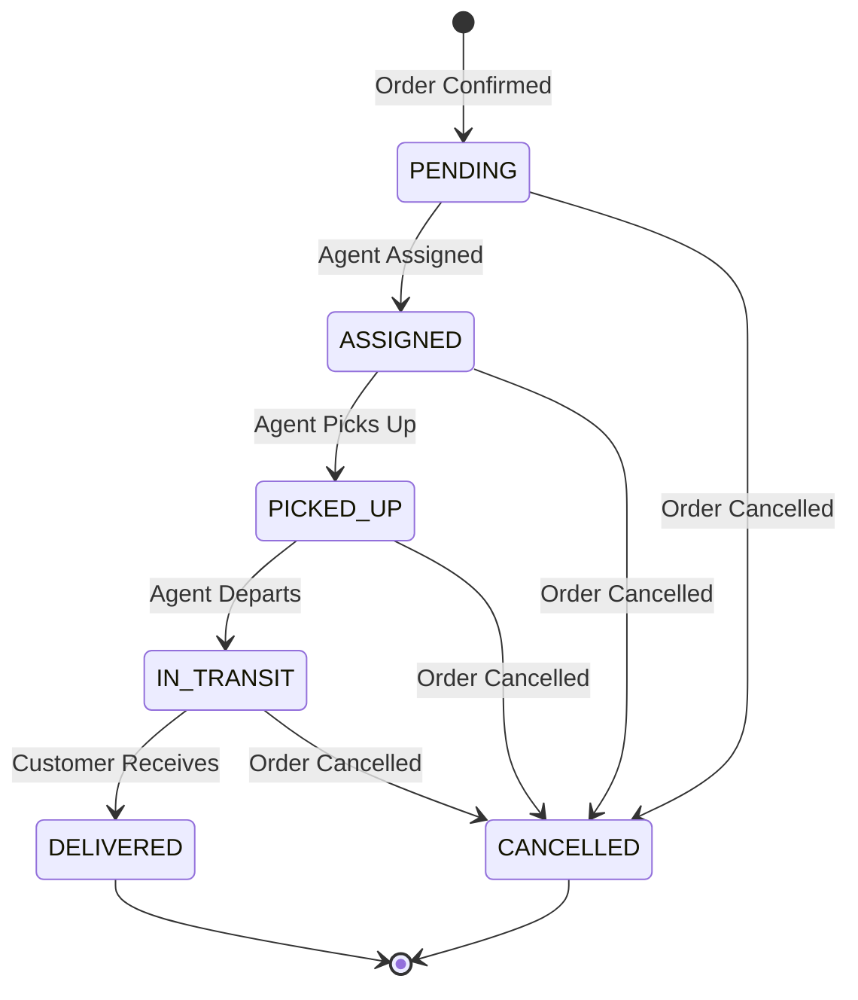

# Delivery Completion Guide

## Overview

The delivery completion process manages the lifecycle of a delivery from pickup to completion, including status updates, agent management, and event publishing.

## Delivery Status Flow



## Status Transitions

### 1. PENDING → ASSIGNED
**Trigger:** Agent assignment algorithm  
**Action:** Assign delivery agent  
**Event:** AGENT_ASSIGNED

### 2. ASSIGNED → PICKED_UP
**Trigger:** Agent picks up order from restaurant  
**Action:** Record pickup timestamp  
**Event:** PICKUP_COMPLETED

**API:**
```http
POST /api/delivery/{deliveryId}/pickup
```

**Process:**
1. Validate current status is ASSIGNED
2. Update status to PICKED_UP
3. Record pickedUpAt timestamp
4. Publish PICKUP_COMPLETED event
5. Notify customer and restaurant

### 3. PICKED_UP → IN_TRANSIT
**Trigger:** Agent departs restaurant  
**Action:** Update status  
**Event:** None (optional LOCATION_UPDATED)

**API:**
```http
POST /api/delivery/{deliveryId}/in-transit
```

**Process:**
1. Validate current status is PICKED_UP
2. Update status to IN_TRANSIT
3. Continue location tracking

### 4. IN_TRANSIT → DELIVERED
**Trigger:** Agent delivers to customer  
**Action:** Complete delivery, release agent  
**Event:** DELIVERY_COMPLETED

**API:**
```http
POST /api/delivery/{deliveryId}/complete
```

**Process:**
1. Validate current status is IN_TRANSIT or PICKED_UP
2. Update status to DELIVERED
3. Record deliveredAt timestamp
4. Update agent status to AVAILABLE
5. Increment agent's totalDeliveries count
6. Publish DELIVERY_COMPLETED event
7. Notify customer, restaurant, and order service

### 5. ANY → CANCELLED
**Trigger:** Order cancellation  
**Action:** Cancel delivery, release agent  
**Event:** DELIVERY_CANCELLED

**API:**
```http
POST /api/delivery/{deliveryId}/cancel?reason=Customer%20unavailable
```

**Process:**
1. Validate not already DELIVERED
2. Update status to CANCELLED
3. Release agent (set to AVAILABLE)
4. Publish DELIVERY_CANCELLED event
5. Notify all parties

## API Endpoints

### Mark Picked Up

```http
POST /api/delivery/{deliveryId}/pickup
```

**Response:** 200 OK

**Errors:**
- 400: Invalid status transition
- 404: Delivery not found

**Example:**
```bash
curl -X POST http://localhost:8085/api/delivery/123/pickup
```

### Mark In Transit

```http
POST /api/delivery/{deliveryId}/in-transit
```

**Response:** 200 OK

**Example:**
```bash
curl -X POST http://localhost:8085/api/delivery/123/in-transit
```

### Complete Delivery

```http
POST /api/delivery/{deliveryId}/complete
```

**Response:** 200 OK

**Side Effects:**
- Agent status → AVAILABLE
- Agent totalDeliveries += 1
- DELIVERY_COMPLETED event published

**Example:**
```bash
curl -X POST http://localhost:8085/api/delivery/123/complete
```

### Cancel Delivery

```http
POST /api/delivery/{deliveryId}/cancel?reason=Customer%20unavailable
```

**Parameters:**
- `reason` (optional): Cancellation reason

**Response:** 200 OK

**Example:**
```bash
curl -X POST "http://localhost:8085/api/delivery/123/cancel?reason=Customer%20unavailable"
```

### Update Status (Generic)

```http
PUT /api/delivery/{deliveryId}/status
Content-Type: application/json

{
  "status": "DELIVERED"
}
```

**Status Values:**
- PENDING
- ASSIGNED
- PICKED_UP
- IN_TRANSIT
- DELIVERED
- CANCELLED

**Example:**
```bash
curl -X PUT http://localhost:8085/api/delivery/123/status \
  -H "Content-Type: application/json" \
  -d '{"status": "DELIVERED"}'
```

## Agent Status Management

### Agent Status Updates

**On Assignment:**
- Agent status: AVAILABLE → BUSY

**On Completion:**
- Agent status: BUSY → AVAILABLE
- Agent totalDeliveries: +1

**On Cancellation:**
- Agent status: BUSY → AVAILABLE

### Agent Statistics

```java
@Entity
public class DeliveryAgent {
    private AgentStatus status;
    private Integer totalDeliveries;
    private BigDecimal rating;
}
```

**Tracked Metrics:**
- Total deliveries completed
- Average rating
- Current status
- Last delivery timestamp

## Event Publishing

### PICKUP_COMPLETED Event

```json
{
  "eventId": "uuid",
  "eventType": "PICKUP_COMPLETED",
  "deliveryId": 123,
  "orderId": 456,
  "agentId": 789,
  "timestamp": "2024-01-15T11:00:00",
  "payload": {
    "pickedUpAt": "2024-01-15T11:00:00"
  }
}
```

**Consumers:**
- Notification Service (notify customer)
- Order Service (update order status)

### DELIVERY_COMPLETED Event

```json
{
  "eventId": "uuid",
  "eventType": "DELIVERY_COMPLETED",
  "deliveryId": 123,
  "orderId": 456,
  "agentId": 789,
  "timestamp": "2024-01-15T11:30:00",
  "payload": {
    "deliveredAt": "2024-01-15T11:30:00"
  }
}
```

**Consumers:**
- Notification Service (notify all parties)
- Order Service (mark order as DELIVERED)
- Payment Service (finalize payment)

## Error Handling

### Invalid Status Transition

```json
{
  "errorCode": "DELIVERY_ERROR",
  "message": "Cannot mark as picked up. Current status: DELIVERED",
  "timestamp": "2024-01-15T11:00:00",
  "path": "/api/delivery/123/pickup"
}
```

**Causes:**
- Attempting invalid state transition
- Delivery already completed
- Delivery cancelled

**Solution:**
- Check current delivery status
- Use correct endpoint for current state

### Delivery Not Found

```json
{
  "errorCode": "RESOURCE_NOT_FOUND",
  "message": "Delivery not found: 123",
  "timestamp": "2024-01-15T11:00:00",
  "path": "/api/delivery/123/complete"
}
```

**Causes:**
- Invalid delivery ID
- Delivery not created yet

**Solution:**
- Verify delivery ID
- Check delivery was created

### Agent Not Found

```json
{
  "errorCode": "RESOURCE_NOT_FOUND",
  "message": "Agent not found: 789",
  "timestamp": "2024-01-15T11:00:00",
  "path": "/api/delivery/123/complete"
}
```

**Causes:**
- Agent deleted
- Invalid agent ID

**Solution:**
- Verify agent exists
- Check data consistency

## Idempotency

All completion endpoints are idempotent:

```java
// Completing already completed delivery
if (delivery.getStatus() == DeliveryStatus.DELIVERED) {
    log.warn("Delivery {} is already completed", deliveryId);
    return; // No error, just return
}
```

**Benefits:**
- Safe to retry
- No duplicate events
- Consistent state

## Testing

### Unit Tests

```java
@Test
void shouldCompleteDelivery() {
    // Given
    Delivery delivery = createInTransitDelivery();
    DeliveryAgent agent = createBusyAgent();
    
    // When
    completionService.completeDelivery(delivery.getId());
    
    // Then
    assertEquals(DeliveryStatus.DELIVERED, delivery.getStatus());
    assertNotNull(delivery.getDeliveredAt());
    assertEquals(AgentStatus.AVAILABLE, agent.getStatus());
    assertEquals(1, agent.getTotalDeliveries());
    verify(eventPublisher).publishDeliveryCompleted(delivery);
}

@Test
void shouldReleaseAgentOnCancellation() {
    // Given
    Delivery delivery = createAssignedDelivery();
    DeliveryAgent agent = createBusyAgent();
    
    // When
    completionService.cancelDelivery(delivery.getId(), "Test");
    
    // Then
    assertEquals(DeliveryStatus.CANCELLED, delivery.getStatus());
    assertEquals(AgentStatus.AVAILABLE, agent.getStatus());
}

@Test
void shouldBeIdempotent() {
    // Given
    Delivery delivery = createInTransitDelivery();
    
    // When
    completionService.completeDelivery(delivery.getId());
    completionService.completeDelivery(delivery.getId()); // Second call
    
    // Then
    // No error, agent totalDeliveries only incremented once
    assertEquals(1, agent.getTotalDeliveries());
}
```

### Integration Tests

```bash
# Setup: Create delivery
curl -X POST http://localhost:8085/api/delivery/assign \
  -d '{"orderId": 123, ...}'

# Test: Mark picked up
curl -X POST http://localhost:8085/api/delivery/1/pickup

# Verify: Status is PICKED_UP
curl http://localhost:8085/api/delivery/track/123 | jq '.status'
# Output: "PICKED_UP"

# Test: Mark in transit
curl -X POST http://localhost:8085/api/delivery/1/in-transit

# Test: Complete delivery
curl -X POST http://localhost:8085/api/delivery/1/complete

# Verify: Status is DELIVERED
curl http://localhost:8085/api/delivery/track/123 | jq '.status'
# Output: "DELIVERED"

# Verify: Agent is AVAILABLE
curl http://localhost:8085/api/delivery/agents/1 | jq '.status'
# Output: "AVAILABLE"

# Verify: Agent deliveries incremented
curl http://localhost:8085/api/delivery/agents/1 | jq '.totalDeliveries'
# Output: 1
```

### End-to-End Test

```bash
# 1. Order confirmed (triggers assignment)
# 2. Agent assigned
# 3. Agent picks up
curl -X POST http://localhost:8085/api/delivery/1/pickup

# 4. Agent in transit
curl -X POST http://localhost:8085/api/delivery/1/in-transit

# 5. Agent delivers
curl -X POST http://localhost:8085/api/delivery/1/complete

# 6. Verify complete flow
curl http://localhost:8085/api/delivery/track/123
```

## Monitoring

### Key Metrics

1. **Completion Rate**: % of deliveries completed
   - Target: > 95%
   - Alert: < 90%

2. **Average Delivery Time**: Time from pickup to delivery
   - Target: < 30 minutes
   - Alert: > 45 minutes

3. **Cancellation Rate**: % of deliveries cancelled
   - Target: < 5%
   - Alert: > 10%

4. **Agent Utilization**: % of time agents are BUSY
   - Target: 60-80%
   - Alert: < 40% or > 90%

5. **Status Transition Time**: Time between status changes
   - Pickup time: < 5 minutes after assignment
   - Delivery time: < 30 minutes after pickup

### Logging

```java
// Pickup
log.info("Delivery {} marked as picked up at {}", deliveryId, pickedUpAt);

// Completion
log.info("Delivery {} completed at {}. Agent {} is now available", 
    deliveryId, deliveredAt, agentId);

// Agent update
log.info("Agent {} updated: status=AVAILABLE, totalDeliveries={}", 
    agentId, totalDeliveries);

// Cancellation
log.info("Delivery {} cancelled. Agent {} released", deliveryId, agentId);
```

### Alerts

- Delivery not picked up within 10 minutes
- Delivery not completed within 60 minutes
- High cancellation rate (> 10%)
- Agent stuck in BUSY status (> 2 hours)

## Best Practices

### 1. Status Validation

Always validate current status before transition:

```java
if (delivery.getStatus() != DeliveryStatus.ASSIGNED) {
    throw new DeliveryException("Invalid status transition");
}
```

### 2. Timestamp Recording

Record timestamps for all status changes:

```java
delivery.setPickedUpAt(LocalDateTime.now());
delivery.setDeliveredAt(LocalDateTime.now());
```

### 3. Agent Management

Always update agent status and statistics:

```java
agent.setStatus(AgentStatus.AVAILABLE);
agent.setTotalDeliveries(agent.getTotalDeliveries() + 1);
```

### 4. Event Publishing

Publish events for all significant state changes:

```java
eventPublisher.publishPickupCompleted(delivery);
eventPublisher.publishDeliveryCompleted(delivery);
```

### 5. Idempotency

Make all operations idempotent:

```java
if (delivery.getStatus() == DeliveryStatus.DELIVERED) {
    return; // Already completed
}
```

## Troubleshooting

### Delivery Stuck in ASSIGNED

**Symptoms:**
- Delivery not progressing
- Agent shows BUSY but no pickup

**Causes:**
- Agent app not updating status
- Network issues
- Agent forgot to mark pickup

**Solutions:**
- Manual status update
- Contact agent
- Reassign to different agent

### Agent Stuck in BUSY

**Symptoms:**
- Agent status BUSY for > 2 hours
- Agent not receiving new assignments

**Causes:**
- Delivery not completed
- Status update failed
- Agent app crashed

**Solutions:**
- Check delivery status
- Manual agent status update
- Complete or cancel delivery

### Events Not Published

**Symptoms:**
- Notifications not sent
- Order status not updated

**Causes:**
- Kafka unavailable
- Event publishing failed
- Consumer not running

**Solutions:**
- Check Kafka connectivity
- Verify event in Kafka topic
- Restart consumers

## Requirements Satisfied

- ✅ **6.5**: Record actual delivery time
- ✅ **6.5**: Update agent availability to AVAILABLE
- ✅ Agent statistics tracking
- ✅ Event publishing for notifications
- ✅ Status transition validation
- ✅ Idempotent operations
- ✅ Comprehensive error handling

