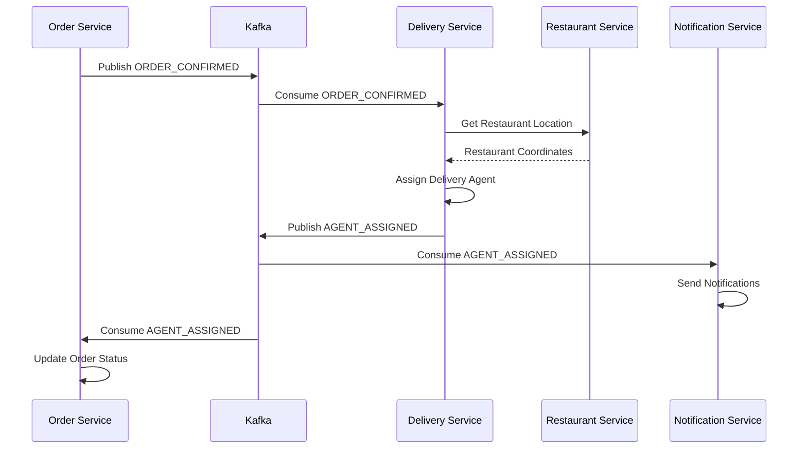

# Kafka Integration Guide

## Overview

The Delivery Service integrates with Apache Kafka for event-driven communication with other microservices. It consumes order events and publishes delivery events to enable real-time updates across the platform.

## Event Flow



## Topics

### Consumed Topics

#### order-events
**Purpose:** Receive order lifecycle events from Order Service

**Event Types Consumed:**
- `ORDER_CONFIRMED` - Triggers agent assignment
- `ORDER_CANCELLED` - Releases assigned agent

**Configuration:**
```yaml
delivery:
  kafka:
    topics:
      order-events: order-events
```

**Consumer Group:**
```yaml
spring:
  kafka:
    consumer:
      group-id: delivery-service-group
```

### Published Topics

#### delivery-events
**Purpose:** Publish delivery lifecycle events

**Event Types Published:**
- `AGENT_ASSIGNED` - Agent assigned to delivery
- `PICKUP_COMPLETED` - Order picked up from restaurant
- `LOCATION_UPDATED` - Agent location updated
- `DELIVERY_COMPLETED` - Order delivered to customer

**Configuration:**
```yaml
delivery:
  kafka:
    topics:
      delivery-events: delivery-events
```

## Event Structures

### OrderEvent (Consumed)

```json
{
  "eventId": "uuid",
  "eventType": "ORDER_CONFIRMED",
  "orderId": 123,
  "orderNumber": "ORD-2024-001",
  "userId": 456,
  "restaurantId": 789,
  "deliveryAgentId": null,
  "orderStatus": "CONFIRMED",
  "totalAmount": 45.99,
  "timestamp": "2024-01-15T10:30:00",
  "deliveryAddress": {
    "addressLine1": "123 Main St",
    "city": "New York",
    "latitude": 40.7489,
    "longitude": -73.9680,
    "phoneNumber": "+1234567890"
  }
}
```

### DeliveryEvent (Published)

```json
{
  "eventId": "uuid",
  "eventType": "AGENT_ASSIGNED",
  "deliveryId": 456,
  "orderId": 123,
  "agentId": 789,
  "timestamp": "2024-01-15T10:30:00",
  "payload": {
    "agentId": 789,
    "agentUserId": 101,
    "vehicleType": "Motorcycle",
    "vehicleNumber": "ABC-1234",
    "estimatedMinutes": 25,
    "restaurantLatitude": 40.7580,
    "restaurantLongitude": -73.9855,
    "deliveryLatitude": 40.7489,
    "deliveryLongitude": -73.9680
  }
}
```

## Event Handlers

### OrderEventListener

**Class:** `com.fooddelivery.delivery.listener.OrderEventListener`

**Methods:**

#### handleOrderEvent
Main Kafka listener method that receives all order events.

```java
@KafkaListener(
    topics = "${delivery.kafka.topics.order-events:order-events}",
    groupId = "${spring.kafka.consumer.group-id:delivery-service-group}",
    containerFactory = "kafkaListenerContainerFactory"
)
public void handleOrderEvent(@Payload OrderEvent event, ...)
```

#### handleOrderConfirmed
Processes ORDER_CONFIRMED events:
1. Validates delivery address has coordinates
2. Fetches restaurant location from Restaurant Service
3. Creates assignment request
4. Assigns delivery agent
5. Logs success/failure

```java
private void handleOrderConfirmed(OrderEvent event)
```

#### handleOrderCancelled
Processes ORDER_CANCELLED events:
1. Finds delivery by orderId
2. Releases assigned agent (sets status to AVAILABLE)
3. Updates delivery status to CANCELLED
4. Publishes DELIVERY_CANCELLED event

```java
private void handleOrderCancelled(OrderEvent event)
```

### DeliveryEventPublisher

**Class:** `com.fooddelivery.delivery.event.DeliveryEventPublisher`

**Methods:**

#### publishAgentAssigned
Publishes AGENT_ASSIGNED event when agent is assigned to delivery.

```java
public void publishAgentAssigned(Delivery delivery, DeliveryAgent agent)
```

#### publishPickupCompleted
Publishes PICKUP_COMPLETED event when agent picks up order.

```java
public void publishPickupCompleted(Delivery delivery)
```

#### publishDeliveryCompleted
Publishes DELIVERY_COMPLETED event when order is delivered.

```java
public void publishDeliveryCompleted(Delivery delivery)
```

#### publishLocationUpdated
Publishes LOCATION_UPDATED event when agent location changes.

```java
public void publishLocationUpdated(Long deliveryId, Long orderId, Long agentId, 
                                  Double latitude, Double longitude)
```

## Configuration

### Kafka Producer

```yaml
spring:
  kafka:
    bootstrap-servers: localhost:9092
    producer:
      key-serializer: org.apache.kafka.common.serialization.StringSerializer
      value-serializer: org.springframework.kafka.support.serializer.JsonSerializer
      acks: all
      retries: 3
```

### Kafka Consumer

```yaml
spring:
  kafka:
    bootstrap-servers: localhost:9092
    consumer:
      group-id: delivery-service-group
      key-deserializer: org.apache.kafka.common.serialization.StringDeserializer
      value-deserializer: org.springframework.kafka.support.serializer.JsonDeserializer
      auto-offset-reset: earliest
      properties:
        spring.json.trusted.packages: "*"
```

## Error Handling

### Consumer Error Handling

```java
try {
    // Process event
    handleOrderConfirmed(event);
} catch (Exception e) {
    log.error("Error processing order event: orderId={}, eventType={}", 
        event.getOrderId(), event.getEventType(), e);
    // In production:
    // - Retry with exponential backoff
    // - Send to dead letter queue
    // - Alert operations team
}
```

### Producer Error Handling

```java
try {
    kafkaTemplate.send(deliveryEventsTopic, event.getOrderId().toString(), event);
} catch (Exception e) {
    log.error("Failed to publish delivery event: {}", event, e);
    // In production:
    // - Retry logic
    // - Store in database for later retry
    // - Alert operations team
}
```

### Dead Letter Queue

For failed events that cannot be processed after retries:

```yaml
spring:
  kafka:
    consumer:
      properties:
        spring.kafka.retry.topic.enabled: true
        spring.kafka.retry.topic.attempts: 3
        spring.kafka.retry.topic.delay: 1000
```

## Service Integration

### Restaurant Service Client

**Purpose:** Fetch restaurant coordinates for agent assignment

**Implementation:** Feign Client with Eureka service discovery

```java
@FeignClient(
    name = "restaurant-service",
    fallback = RestaurantServiceClientFallback.class
)
public interface RestaurantServiceClient {
    @GetMapping("/api/restaurants/{restaurantId}")
    RestaurantDto getRestaurant(@PathVariable Long restaurantId);
}
```

**Fallback:** Returns default coordinates if service is unavailable

```java
@Component
public class RestaurantServiceClientFallback implements RestaurantServiceClient {
    @Override
    public RestaurantDto getRestaurant(Long restaurantId) {
        log.error("Restaurant Service unavailable, using fallback");
        // Return cached or default coordinates
    }
}
```

## Testing

### Unit Tests

```java
@Test
void shouldHandleOrderConfirmedEvent() {
    // Given: ORDER_CONFIRMED event
    OrderEvent event = createOrderConfirmedEvent();
    
    // When: Event is processed
    listener.handleOrderEvent(event, "order-events", 0, 0);
    
    // Then: Agent is assigned
    verify(assignmentService).assignAgent(any());
}

@Test
void shouldHandleOrderCancelledEvent() {
    // Given: ORDER_CANCELLED event
    OrderEvent event = createOrderCancelledEvent();
    
    // When: Event is processed
    listener.handleOrderEvent(event, "order-events", 0, 0);
    
    // Then: Agent is released
    // Verify agent status updated to AVAILABLE
}
```

### Integration Tests

```bash
# Start Kafka
docker-compose up -d kafka

# Publish test event
kafka-console-producer --broker-list localhost:9092 --topic order-events
> {"eventId":"test-1","eventType":"ORDER_CONFIRMED","orderId":123,...}

# Verify event consumed
# Check logs for "Processing ORDER_CONFIRMED event for order: 123"

# Verify agent assigned
curl http://localhost:8085/api/delivery/track/123

# Verify event published
kafka-console-consumer --bootstrap-server localhost:9092 --topic delivery-events --from-beginning
```

### Load Testing

Simulate high event volume:

```bash
# Publish 1000 events
for i in {1..1000}; do
  echo '{"eventId":"'$i'","eventType":"ORDER_CONFIRMED","orderId":'$i',...}' | \
  kafka-console-producer --broker-list localhost:9092 --topic order-events
done

# Monitor consumer lag
kafka-consumer-groups --bootstrap-server localhost:9092 \
  --describe --group delivery-service-group
```

## Monitoring

### Key Metrics

1. **Consumer Lag**: Messages waiting to be processed
2. **Processing Time**: Time to process each event
3. **Error Rate**: Failed event processing rate
4. **Throughput**: Events processed per second
5. **Assignment Success Rate**: % of successful assignments

### Kafka Metrics

```bash
# Consumer lag
kafka-consumer-groups --bootstrap-server localhost:9092 \
  --describe --group delivery-service-group

# Topic details
kafka-topics --bootstrap-server localhost:9092 \
  --describe --topic order-events
```

### Application Metrics

```java
// Custom metrics
@Autowired
private MeterRegistry meterRegistry;

// Count events processed
meterRegistry.counter("order.events.processed", 
    "type", event.getEventType().toString()).increment();

// Track processing time
Timer.Sample sample = Timer.start(meterRegistry);
// Process event
sample.stop(meterRegistry.timer("order.events.processing.time"));
```

### Logging

```java
log.info("Received order event: type={}, orderId={}, topic={}, partition={}, offset={}",
    event.getEventType(), event.getOrderId(), topic, partition, offset);

log.info("Processing ORDER_CONFIRMED event for order: {}", event.getOrderId());

log.info("Successfully assigned agent {} to order {} (estimated: {} minutes)",
    response.getAgentId(), event.getOrderId(), response.getEstimatedMinutes());

log.error("Failed to assign agent for order {}: {}", event.getOrderId(), e.getMessage());
```

## Troubleshooting

### Consumer Not Receiving Events

1. Check Kafka is running: `docker ps | grep kafka`
2. Verify topic exists: `kafka-topics --list --bootstrap-server localhost:9092`
3. Check consumer group: `kafka-consumer-groups --describe --group delivery-service-group`
4. Verify service is connected: Check logs for "Kafka consumer started"
5. Check network connectivity to Kafka

### Events Not Being Processed

1. Check consumer lag (should be 0 or low)
2. Verify event format matches expected structure
3. Check for errors in logs
4. Verify Restaurant Service is available
5. Check database connectivity

### High Consumer Lag

1. Increase consumer instances (scale horizontally)
2. Increase partition count for parallel processing
3. Optimize event processing logic
4. Check for slow database queries
5. Monitor Restaurant Service response time

### Events Not Being Published

1. Check Kafka producer configuration
2. Verify topic exists
3. Check for serialization errors
4. Monitor Kafka broker health
5. Check network connectivity

## Best Practices

### 1. Idempotency

Ensure event handlers are idempotent:

```java
// Check if already processed
if (deliveryRepository.findByOrderId(orderId).isPresent()) {
    log.info("Order {} already has delivery assigned, skipping", orderId);
    return;
}
```

### 2. Event Versioning

Include version in events for backward compatibility:

```json
{
  "eventVersion": "1.0",
  "eventType": "ORDER_CONFIRMED",
  ...
}
```

### 3. Correlation IDs

Use correlation IDs for tracing:

```java
MDC.put("correlationId", event.getEventId());
log.info("Processing event");
MDC.clear();
```

### 4. Graceful Degradation

Handle service unavailability:

```java
try {
    restaurant = restaurantServiceClient.getRestaurant(restaurantId);
} catch (Exception e) {
    // Use cached data or default coordinates
    restaurant = getCachedRestaurant(restaurantId);
}
```

### 5. Circuit Breaker

Protect against cascading failures:

```java
@CircuitBreaker(name = "restaurantService", fallbackMethod = "getRestaurantFallback")
public RestaurantDto getRestaurant(Long restaurantId) {
    return restaurantServiceClient.getRestaurant(restaurantId);
}
```

## Requirements Satisfied

- ✅ **5.1**: Trigger agent assignment when order is confirmed
- ✅ **12.3**: Publish domain events to message broker
- ✅ Event-driven architecture
- ✅ Asynchronous processing
- ✅ Service decoupling
- ✅ Real-time updates

